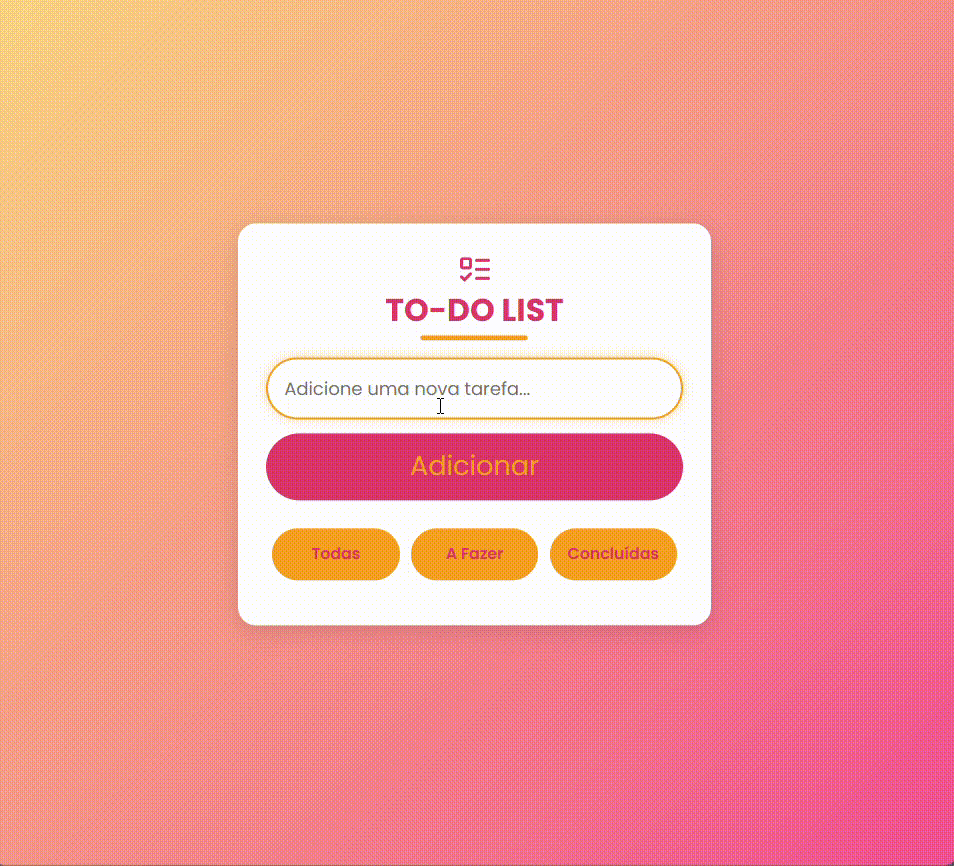

# 📝 To-Do List com React

Este é um aplicativo simples de lista de tarefas (To-Do List) construído com React. Ele permite adicionar, editar, marcar como concluído e excluir tarefas, além de filtrar as tarefas por status (pendentes ou concluídas).


[](https://todolist-react-alicessena.vercel.app/)

## 🚀 Funcionalidades

- **Adicionar Tarefa:** Você pode adicionar novas tarefas digitando no campo de entrada e pressionando "Enter" ou clicando no botão "Adicionar".
- **Marcar como Concluída:** As tarefas podem ser marcadas como concluídas ao clicar na caixa de seleção ao lado delas.
- **Edição de Tarefa:** Ao clicar no ícone de edição, você pode alterar o título da tarefa.
- **Remover Tarefa:** Você pode excluir tarefas clicando no ícone de lixeira.
- **Notificação:** O aplicativo exibe notificações breves ao adicionar, editar ou remover tarefas.

<table border="2">
  <tr>
    <td>
        <h3> Criando Tarefa </h3>
        <a href=""></a>
    </td>
      <td>
        <h3> Editando Tafera </h3>
        <a href=""></a>
    </td>
    <td>
      <h3> Deletando Tafera </h3>
      <a href=""></a>
    </td>
  </tr>

  </table>

  - **Filtragem de Tarefas:** O aplicativo oferece três filtros:
  - **Todas:** Exibe todas as tarefas.
  - **A Fazer:** Exibe apenas as tarefas não concluídas.
  - **Concluídas:** Exibe apenas as tarefas concluídas.

  <table border="2">
  <tr>
    <td>
        <h3> Todas </h3>
        <a href=""></a>
    </td>
      <td>
        <h3> A Fazer </h3>
        <a href=""></a>
    </td>
    <td>
      <h3> Concluídas </h3>
      <a href=""></a>
    </td>
  </tr>

  </table>

## 🛠️ Estrutura do Código

O código é dividido em componentes React principais, sendo o `Todo` o principal componente funcional que gerencia o estado da lista de tarefas e interações com o usuário.

### 📌 Estado do Componente

- `todos`: Armazena a lista de tarefas.
- `todoInput`: Controla o valor de entrada do campo de nova tarefa.
- `filter`: Armazena o filtro atual de tarefas (todas, pendentes ou concluídas).
- `editingId`: Armazena o ID da tarefa que está sendo editada.
- `editingText`: Armazena o texto da tarefa enquanto ela está sendo editada.
- `notification`: Armazena a mensagem de notificação exibida para o usuário.

### 📌 Funções Importantes

- **addTodo()**: Adiciona uma nova tarefa à lista.
- **toggleCheck(id)**: Marca uma tarefa como concluída ou não.
- **removeTodo(id)**: Remove uma tarefa da lista.
- **startEditing(id, title)**: Inicia a edição de uma tarefa.
- **saveEditing(id)**: Salva as alterações feitas na tarefa.
- **showNotification(message)**: Exibe uma notificação temporária.

### 📌 Filtros de Tarefas

A função `filteredTodos` filtra as tarefas de acordo com o valor do estado `filter` e exibe as tarefas que atendem aos critérios selecionados.

### 💻 Tecnologias Ultilizadas
- React.js
- Lucide Icons
- CSS para estilos

## 🔍 Como Rodar o Projeto localmente

1. Clone o repositório:
   ```bash
   git clone https://github.com/seu-usuario/nome-do-repositorio.git
